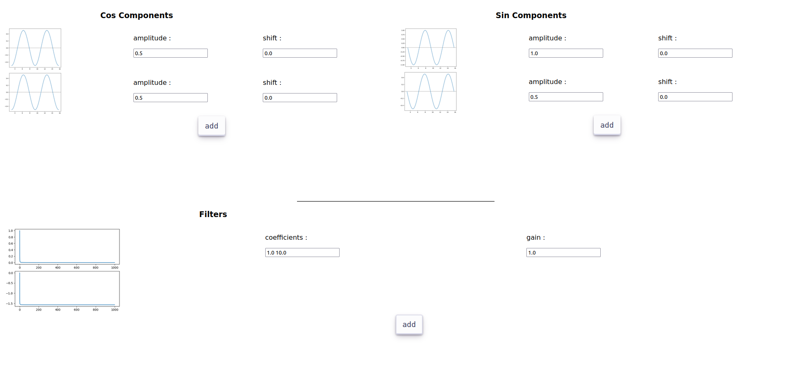

# AudioGen



A basic wave generator and filtering app in python (with sound !)

# Description

This website, is an interface to a signal processing API.
The API, developped with fastapi, is composed of two routes,

- Get_Wave_With :

needs a json of the form
```json
{
    "amplitudes" : [],
    "shifts" : [],
    "functions" : []
}
```

and return an image of the wave as described by the JSON

- Get_Filter_With :

needs a json of the form
```json
{
    "coefficients" : [],
    "gain" : x
}
```

and return an image of the filter as described by the JSON

Each time an input is modified, a call to the backend is done in order to update
both the image associated with the modification, and the final result. Response
time can be optimized by putting into server-memory data that has already been
calculated.
