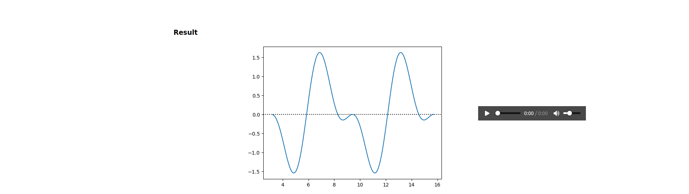

# AudioGen




A basic wave generator and filtering API (with sound !)

# Description

This website, is an interface to a signal processing API.
The API, developped with fastapi, is composed of several routes,

- /Get_Wave_With :

needs a json of the form
```json
{
    "amplitudes" : [1.0, 2.0, 0.5],
    "shifts"     : [0.2, 0.5, 1.2],
    "functions"  : ["Cos", "Sin", "Sin"]
}
```

and return an image of the wave.

- /Get_Wave_Sound :

needs a json of the form
```json
{
    "amplitudes" : [1.0, 2.0, 0.5],
    "shifts"     : [0.2, 0.5, 1.2],
    "functions"  : ["Cos", "Sin", "Sin"]
}
```

and return a base64 encoding of a .wav file of the wave

- /Get_Filter_With :

needs a json of the form
```json
{
    "coefficients" : [2.0, 10.0, 2.0], // "order", "fc/f0", "Q"
    "gain" : 2.0
}
```

and return an image of the filter.

Each time an input is modified, a call to the backend is done in order to update
both the image associated with the modification, and the final result. Response
time can be optimized by putting into server-memory data that has already been
calculated.

# Run

To run the Interface, you must either have a .venv and activate it in the project
folder with ```source .venv/bin/activate``` or have all the dependencies already
installed on your computer.
Either way, those are :
- numpy >= 1.24.4
- scipy >= 1.10.1
- matplotlib >= 3.7.5
- fastAPI >= 0.1.0
- Unittest

To lunch the backend, please use ```fastapi dev src/server/app.py``` in ./src
